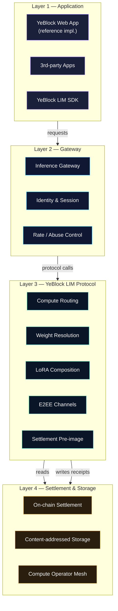
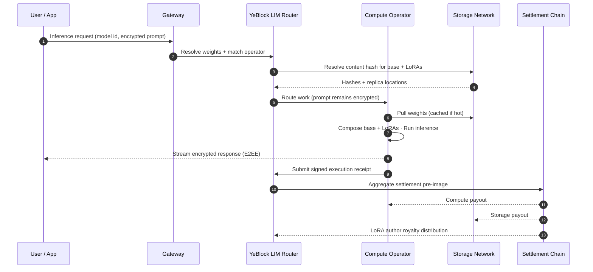

# YeBlock LIM — Architecture

> This document describes the **target architecture** of the YeBlock LIM protocol stack and the YeBlock reference network. Components marked *(Planned)* are in design or early prototyping. The architecture is intentionally specified before implementation: it is the contract against which the implementation will be evaluated.

## Table of Contents

- [Design Goals](#design-goals)
- [Design Invariants](#design-invariants)
- [System Layers](#system-layers)
- [The Five Pillars in Detail](#the-five-pillars-in-detail)
- [Inference Request Lifecycle](#inference-request-lifecycle)
- [Settlement Choreography](#settlement-choreography)
- [The Liquid Economy Applications](#the-liquid-economy-applications)
- [Trust Boundaries](#trust-boundaries)
- [Security Model](#security-model)
- [Why This Architecture, Not Another](#why-this-architecture-not-another)
- [What is Out of Scope (and Why)](#what-is-out-of-scope-and-why)

---

## Design Goals

The architecture is shaped by five non-negotiable goals. Every component decision is checked against this list.

| Goal | What It Means in Practice |
|---|---|
| **Permissionless at every layer** | No participant — operator, author, user — requires registration to join the network. Anti-abuse is enforced by economics and cryptography, not by gatekeepers. |
| **Composable by default** | Any output of one pillar can be the input of another, without bespoke integration. A LoRA adapter from Pillar 3 can be served by any operator in Pillar 1, paid via Pillar 4-encrypted channels, and settled with Pillar 5 forward-secure signatures. |
| **Verifiable, not trusted** | Operators are paid for *provable* work. Users get *cryptographic* receipts. Storage providers commit to *content-addressed* hashes. Trust is replaced with verification at every interface. |
| **Forward-secure** | The protocol must remain secure under cryptographic assumptions that are not yet broken but will be. Post-quantum primitives are not an afterthought; they are the baseline. |
| **Boring at the edges** | Application developers should be able to use YeBlock LIM through familiar SDK shapes (REST/SSE/streaming) without learning protocol internals. Complexity belongs inside the protocol, not at its surface. |

## Design Invariants

A goal is something we strive for. An **invariant** is something that must hold *at all times* for any conformant YeBlock LIM implementation. Invariants are the protocol's load-bearing walls — they are the properties that, if any one of them is broken, the system is no longer YeBlock LIM.

There are eight.

### I-1. Content Identity is the Universal Reference

Every artifact addressable by YeBlock LIM — base model, LoRA adapter, royalty manifest, conformance suite, execution receipt — is identified solely by the cryptographic hash of its content under a forward-secure hash function. There is no separate name registry, no DNS-like indirection, no version numbering scheme that can be re-pointed.

> *Consequence:* duplicate artifacts have identical identities. Plagiarism is mechanically detectable. Cache keys are protocol-defined.

### I-2. Permissionless On-Ramp at Every Role

Anyone who can post a stake commitment and pass the conformance suite for a given role (operator, gateway, storage provider, author) is eligible to participate. There is no allowlist, no jurisdictional gate, and no role for which the protocol checks human identity. KYC, where applied, is an application-layer policy.

> *Consequence:* the protocol cannot be captured by gating who participates. Capture, if it happens, must be at the gateway or application layer — where users can choose alternatives.

### I-3. Single Source of Cryptographic Truth per Object

Every signed object carries an explicit algorithm tag. Verification is performed against the tag, not against a globally fixed scheme. The tag is part of the signed payload; it cannot be silently downgraded.

> *Consequence:* the protocol can absorb new cryptographic primitives without breaking historical signatures. Algorithm migration is a protocol feature, not a protocol failure.

### I-4. End-to-End Encryption is Non-Optional

Prompts and responses between user and operator are encrypted under session keys derived from a hybrid post-quantum KEM. The gateway, the router, any intermediate observer — and any quantum adversary recording today's ciphertext — cannot recover plaintext. This is true regardless of the privacy tier the user selects.

> *Consequence:* there is no "plaintext mode" in YeBlock LIM. There is only "with confidential inference" and "without."

### I-5. Receipts are Settlement Instruments, Not Logs

Every executed inference produces a signed receipt that names the operator, the model identity, and the resource consumption. Receipts are deduplicatable on settlement, immutable once signed, and verifiable in `O(log n)` of bundle size. A receipt is *the* unit of payment; there is no parallel accounting system.

> *Consequence:* operators are paid for exactly the work they prove, and disputes resolve against signed evidence rather than vendor support tickets.

### I-6. Royalties Settle Atomically with Compute

When an inference settles, the compute operator's payout, the storage provider's fees, and every LoRA author's royalty share are dispatched in the same chain transaction. There is no staging period during which any party holds funds owed to another.

> *Consequence:* the protocol cannot withhold author royalties as a business model. Royalty manifests are honored by the chain itself, not by a platform.

### I-7. Stake is the Unit of Trust

Every party whose misbehavior could damage another party must post stake proportional to the damage they could cause. Operators who deviate lose stake. Storage providers who delete replicas lose stake. Gateways that forge receipts lose stake. The protocol does not extend trust on social, contractual, or reputational grounds.

> *Consequence:* the cost of attacking the network scales with the value of the network. Reputation is a useful signal but never a substitute for collateral.

### I-8. The Protocol is Policy-Neutral

YeBlock LIM specifies how inference travels, how it is paid for, and how it is verified. It does not specify what inference is allowed, what content is acceptable, or what users may say or read. Policy is enforced at the gateway and application layers, where users can choose between competing policies. The protocol itself takes no side.

> *Consequence:* YeBlock LIM is not a moderator. It cannot censor, and it cannot be compelled to censor at the protocol layer. Compulsion, when applied, applies to specific applications or gateways — never to the substrate.

These eight invariants are normative. A system that violates any of them is, by construction, not YeBlock LIM.

## System Layers

The full system is best understood as **four horizontal layers** sitting on top of the **five YeBlock LIM pillars**.



| Layer | Responsibility | Owned By |
|---|---|---|
| **L1 — Application** | User interfaces, developer SDKs, application-specific logic. | Application authors (incl. YeBlock reference web app). |
| **L2 — Gateway** | Translates application-shaped requests into protocol calls. Handles session lifecycle, identity, rate control. | Anyone — there can be many gateways; YeBlock operates one reference gateway. |
| **L3 — YeBlock LIM Protocol** | Routes workloads, resolves weights, composes LoRAs, manages encrypted channels, produces settlement pre-images. | Open protocol — implemented by node clients. |
| **L4 — Settlement & Storage** | Persists weights, executes inference, settles payments on-chain. | Independent participants (operators, storage providers, the chain). |

## The Five Pillars in Detail

### Pillar 1 — Decentralized Compute

**Function:** Match inference requests to compute operators with the best price/quality/latency profile, then verify execution.

**Key components:**

- *Routing* — A reputation-weighted, latency-aware matcher that selects an operator (or shard of operators for redundancy) per request.
- *Execution* — Standardized inference runtime contract; operators who pass the conformance suite are eligible for routing.
- *Verification* — Lightweight challenge-response and statistical sampling. Heavyweight cryptographic verification (zkML / TEE attestation) is a future option but not a baseline requirement; the baseline is *economic verification* — operators who deviate lose stake.

**Permissionless on-ramp:** any participant who can run the conformance suite and post a stake can route work. No allowlist.

### Pillar 2 — Decentralized Storage

**Function:** Distribute and persist model weights, LoRA adapters, and inference receipts using content-addressed storage.

**Key components:**

- *Weight registry* — Maps human-readable model identifiers to content hashes plus metadata (license, author, version lineage).
- *Replication market* — Storage providers earn fees for keeping replicas live. Replication count is a function of demand, not central decree.
- *Garbage collection* — A weight is preserved as long as a single replica is paid for. There is no central deprecation authority.

**Why this matters:** model weights are infrastructure. A model that disappears because a vendor pivots is a structural failure of centralized AI. YeBlock LIM treats weights as public goods with an explicit, market-cleared replication budget.

### Pillar 3 — Decentralized AI

**Function:** Compose base models with LoRA adapters at request time, on the operator that won routing.

**Key components:**

- *Composition runtime* — Loads a base model + ordered list of LoRA adapters and produces inference output.
- *LoRA author registry* — Every adapter is signed by an author identity; royalty splits are encoded in the adapter manifest.
- *Per-request royalties* — Each inference settles with the base model author *and* every LoRA author whose adapter was applied.

**Why LoRA-granular?** It moves the unit of contribution from "publish a model" to "publish a behavior." Authors can be paid for fine-grained skills (a tone, a domain expertise, a refusal pattern), and applications can compose them on demand.

### Pillar 4 — Privacy Protocol

**Function:** Ensure that a compute operator can execute an inference without learning the prompt or the response.

**Key components:**

- *End-to-end encrypted channels* — The user terminates encryption; the gateway and the operator carry encrypted traffic.
- *Confidential inference (Phase B)* — TEE-attested execution where the operator runs the inference inside an enclave whose memory is opaque to the host.
- *Metadata minimization* — Routing carries only what is required to schedule (size class, latency budget). Content stays with the user.

**Trade-off acknowledged:** confidential inference adds latency and limits operator flexibility (TEE-equipped GPUs are a subset of the network). YeBlock LIM offers privacy as a tier the user explicitly opts into, not a one-size-fits-all default.

### Pillar 5 — Post-Quantum

**Function:** Ensure the protocol remains secure as cryptographic assumptions evolve.

**Key components:**

- *Post-quantum signatures* — Used for settlement pre-images, weight registry entries, and identity. Lattice-based schemes (e.g. Dilithium-class) are the baseline.
- *Hybrid key exchange* — Channels use classical + post-quantum hybrid KEM so that traffic recorded today cannot be retroactively decrypted by a future quantum adversary.
- *Algorithm agility* — Every signed object carries an algorithm tag. Migrating to a new primitive does not invalidate historical receipts.

**Posture:** YeBlock LIM is not a research project on post-quantum cryptography. It uses standardized, conservatively-vetted primitives. The contribution is *applying them across an entire stack*, not inventing new ones.

## Inference Request Lifecycle

A single YeBlock LIM-native inference exercises every pillar. The lifecycle below is the protocol-level happy path.



Steps that are noteworthy:

- **Step 6** — The operator pulls weights it does not have cached. Hot operators pay no storage fees per request; cold operators amortize them across requests.
- **Step 8** — The user receives the response *before* on-chain settlement completes. Settlement is a background concern.
- **Step 10** — Royalties are paid by content hash, not by name. There is no ambiguity about which LoRA author earned what.

## Settlement Choreography

Settlement is **batched, not per-request**, to keep on-chain footprint low.

- Operators sign an execution receipt for each inference. Receipts include: model hash, LoRA hashes, latency class, byte-counts, and a forward-secure signature.
- The gateway (or any third party) aggregates receipts into a settlement bundle and submits it to the chain on a fixed cadence (e.g. every block or every N receipts).
- The chain validates signatures, deduplicates, and distributes payouts in a single transaction per bundle.
- Disputes are handled by an on-chain challenge window during which any party can submit counter-evidence.

This pattern is intentionally similar to optimistic rollup choreography. The novelty is **what** is being attested, not **how** the attestation is processed.

## The Liquid Economy Applications

The five pillars are the substrate. The **Liquid Economy** is the set of three protocol-native applications built on top of them — **YeBlock LIME** (Liquid Idea Market & Execution), **YeBlock LEM** (Liquid Energy Mesh), and **YeBlock LIP** (Liquid Intelligence Pay). They are architectural recompositions, not new trust machinery: each one reuses receipts (I-5), atomic royalty settlement (I-6), stake-and-slash (I-7), TEE attestation (Pillar 4), and post-quantum signatures (Pillar 5). All three are design-stage; their normative interfaces live in [docs/lim-protocol.md §11](./docs/lim-protocol.md#11-the-liquid-economy-extensions) and [`reference/`](./reference).

### YeBlock LIME — Idea Lifecycle

An idea on YeBlock LIME is an **IdeaCapsule**: client-side-encrypted content plus a public teaser, registered on-chain with a content hash, license terms, and pricing — signed with a post-quantum signature. The registration timestamp is a **Proof of Priority**: "this idea existed, authored by this identity, at this time," verifiable even against a future quantum adversary.

```
1. Mint        Author encrypts idea → uploads to content-addressed storage →
               registers hash + teaser + terms on-chain (PQ-signed).        [Pillars 2, 5]
2. Teaser      Market displays only the public abstract. Full content
               stays encrypted; keys stay with the author.                  [Pillar 4 — L1]
3. Escrow      A funder locks payment in an escrow contract. Author grants
               decryption. Mode: buy-out, or licensed execution with
               perpetual royalties (mirrors the LoRA royalty model).
4. Execute     The mesh decomposes the capsule into a task pipeline; each
               task is routed to operators as composed models (base + LoRA
               stack). High-value capsules pin execution to TEE operators
               so node owners cannot read the idea.                         [Pillars 1, 3, 4 — L2]
5. Reverse-    Steps no model can perform (physical-world legwork,
   hire        credentialed sign-off, final human judgment) are posted as
               priced human tasks. Human executors post stake, deliver
               against receipts, are spot-checked by model-based QA, and
               are slashable — the same regime as any operator.             [I-5, I-7]
6. Settle      All receipts (machine and human) validate → escrow settles
               atomically. Downstream revenue replays the royalty
               waterfall with two added seats: idea author and human
               executor(s).                                                 [I-6]
7. Lineage     Derivative ideas reference their parents on-chain; revenue
               flows upstream through the same derivative-aware waterfall
               that LoRA lineages use. Archival signatures (SLH-DSA class)
               keep the lineage verifiable for decades.                     [Pillars 2, 5]
```

This design depends entirely on Pillar 4. Without encrypted teasers and operator-blind execution, an idea market fails at step 2, because anyone could copy an idea the moment it was published. That is why YeBlock LIME is an application of the mesh and not a standalone product.

### YeBlock LEM — Energy Paths

YeBlock LEM begins from a physical constraint the protocol refuses to paper over: **electricity does not travel; intelligence does**. YeBlock LEM never touches physical power delivery, virtual power plants, or grid interconnects. It converts energy advantage into network advantage *in place*, through three paths:

| Path | Who | Mechanism |
|---|---|---|
| **A — Energy-to-Compute** | Has power *and* hardware | Routing gains energy-aware signals (energy cost, carbon intensity, time-of-day) alongside reputation/price/latency. Batch and bulk workloads migrate to the cheapest power; the operator's margin *is* the energy differential. |
| **B — Energy Hosting** | Has power, no hardware | Hardware owners deploy machines at an energy provider's site. The node's revenue splits on-chain between the **hardware seat** and the **energy seat** by a freely negotiated ratio — trustless, because settlement enforces the split. |
| **C — Energy Credits** | Has attestable supply | Metered contributions (smart meter, TEE-signed) mint **JouleCredits** — auditable on-chain energy credits. Operators buy them to offset power costs; ESG-constrained buyers retire green-attested credits. Surplus windows (solar noon, curtailed wind) list at a discount, and the scheduler shifts elastic workloads into them. |

Energy attestation follows the same trust pattern as compute: **PoEC (Proof of Energy Contribution)** — meter readings signed inside a TEE, metering detail encrypted (only aggregates public), credits PQ-signed for decade-scale audit validity, and over-reporting slashed against stake with redundant-meter cross-checks.

To be clear about scope: YeBlock LEM is not an energy market and does not claim to move a single watt. It is an information and settlement layer that makes the energy already attached to the network visible to routing and settlement.

### YeBlock LIP — Settlement Rail

YeBlock LIP generalizes the protocol's internal settlement into a payment rail shaped for machines. Human payment rails are low-frequency / high-value; machine-economy payments are the inverse — per-token amounts at agent frequency, with multi-party fan-out on every call. Three layers, inside-out:

1. **The network's own settlement engine.** Every settled inference already fans out to many seats (operator, LoRA authors, idea author, human executors, storage, protocol). YeBlock LIP upgrades batched settlement to **streaming settlement** — value flows per receipt rather than per bundle window, bounded by the same bundle validation rules.
2. **Agent wallets.** Account-abstracted wallets held by AI agents under owner-set policy: per-call and daily limits, recipient allowlists, purpose constraints, instant revocation. Keys live in TEEs. Within policy, an agent pays autonomously — for API calls, data, compute, other agents, or human tasks.
3. **A2A clearing.** In multi-agent pipelines (a YeBlock LIME execution is one), agents settle with each other at machine latency. This layer is open to external applications: any agent system can clear over YeBlock LIP without running inference on the mesh.

YeBlock LIP's distinguishing property is inherited rather than invented: **every payment is anchored to a signed execution receipt** (I-5). A conventional rail can prove that money moved, but not that the inference being paid for actually ran. YeBlock LIP bundles the payment with the signed execution receipt, so both are verified together.

Two practical limits: throughput figures for the settlement rail are design-capacity targets, validated only by public testnet measurements; and YeBlock LIP does not provide fiat on/off-ramps or target human retail payments. It is scoped to in-protocol settlement and machine-to-machine payments.

## Trust Boundaries

Knowing who can lie about what — and what the protocol does about it — is the core of any decentralized system.

| Party | Can Lie About | Protocol Defense |
|---|---|---|
| **Compute Operator** | Whether an inference was actually executed; whether the right weights were used. | Spot-check verification + economic stake slashing. Future: cryptographic verification (zkML / TEE attestation). |
| **Storage Provider** | Whether a replica is actually held. | Challenge-response proofs of retrievability; payment is conditional on responding to challenges. |
| **Gateway** | Routing fairness; rate limits. | Multiple competing gateways; users are free to use any of them. The reference YeBlock gateway is one option, not the only one. |
| **LoRA Author** | Provenance of an adapter (claiming work that isn't theirs). | Content-addressed storage means duplicate adapters get the same hash; the protocol settles royalties to whoever published first under a verified identity. |
| **User** | Generated content claims; abuse of paid operators. | Application-level abuse control + per-account economic deposits. |

Note that **the protocol does not pretend to solve content moderation**. That is an application-layer concern, deliberately kept out of the core.

## Security Model

YeBlock LIM's security posture sits on three legs:

1. **Cryptographic security** — All signatures, encryption, and identity primitives are post-quantum or hybrid post-quantum. Recorded traffic and historic receipts remain secure under foreseeable advances in cryptanalysis.
2. **Economic security** — Operators stake collateral that is slashable if they deviate from protocol rules. The cost of attack scales with the value of the network.
3. **Game-theoretic security** — There is no privileged role. No single party — including the YeBlock founders — can unilaterally censor, freeze, or reverse any operation in the steady-state protocol.

Components that have not yet reached steady state (e.g. early gateway operations during pre-alpha) carry temporary trust assumptions and are documented as such where they exist.

## Why This Architecture, Not Another

The decentralized AI space is crowded. Many projects make adjacent claims. The architecture above was chosen *deliberately*, against several plausible alternatives. The justification is below — not to dismiss other designs, but to make our trade-offs legible.

### Why Not "Decentralized GPU Marketplace"

A pure GPU marketplace (rent idle GPUs, run workloads, settle in a token) addresses the *supply* problem but ignores everything else. LoRA composition, royalty settlement, end-to-end encryption, and post-quantum durability are not marketplace concerns — they require protocol-level guarantees. A marketplace is a billing front-end with extra steps; a protocol is a substrate.

YeBlock LIM aggregates idle GPUs as a *consequence* of Pillar 1, not as a goal. The other four pillars are what make YeBlock LIM a protocol rather than a procurement system.

### Why Not "AI Subnet on a Generic Mining Network"

Networks that retrofit AI inference onto a generic proof-of-work or proof-of-resource substrate inherit that substrate's design priors — tokenomics optimized for hash power, governance optimized for miner politics, primitives optimized for currency settlement. Inference work has different shape: it is latency-sensitive, content-sensitive, royalty-aware, and privacy-preserving in ways currency settlement is not.

YeBlock LIM specifies the protocol from the ground up around inference's actual requirements. It can settle on any chain, but its design is not warped to fit a chain's existing economic narrative.

### Why Not "Federated Learning Network"

Federated learning addresses *training* under privacy constraints. YeBlock LIM addresses *inference*. They are adjacent but distinct problems with different threat models, different latency budgets, different economic shapes, and different participants. Most users will never train; every user will inference.

A future YeBlock LIM extension may incorporate decentralized fine-tuning, but the v1 protocol is scoped to inference because inference is where the immediate cognitive feudalism is being built.

### Why Not "L1 / L2 / App-chain"

YeBlock LIM is chain-agnostic at the protocol layer. We considered shipping a custom L1 ("the AI chain") and rejected it. The reasons:

1. Chain design is its own enormous problem; conflating it with protocol design slows both.
2. Settlement chains evolve faster than inference protocols. Coupling YeBlock LIM to a single chain freezes the protocol against the worst part of the stack.
3. Most users do not care which chain a settlement uses. They care about correctness and finality, both of which are properties of any production chain.

YeBlock LIM is implemented today by binding a settlement contract suite to a chosen chain. That binding is replaceable.

### Why Not "Just Use OpenRouter / Together / Replicate"

Existing inference aggregators are products, not protocols. They do not offer LoRA-granular royalty settlement, content-addressed weight identity, end-to-end encryption with operator-blind execution, or forward-secure cryptographic guarantees. Any aggregator could add these features tomorrow; none would, because doing so undermines the aggregator's pricing power.

YeBlock LIM is the *protocol layer* aggregators could conform to if they chose. We are building the protocol because no aggregator will build it themselves.

## What is Out of Scope (and Why)

A protocol is defined as much by what it refuses to do as by what it does. YeBlock LIM explicitly does **not** address:

- **Content moderation policy.** This is the responsibility of applications and gateways. YeBlock LIM is policy-neutral by design — it is a protocol, not a publisher.
- **Token speculation.** YeBlock LIM may eventually have a network token for staking, settlement, and governance. The protocol design does not depend on the token having any particular market price.
- **Model alignment research.** YeBlock LIM provides a substrate on which alignment work can run; it does not contribute novel alignment techniques. We defer to the broader research community on what models *should* do, and focus on how they *get to users*.
- **Identity issuance.** YeBlock LIM uses cryptographic identities. Mapping those to legal identities, KYC, or social reputation is an application concern.

These omissions are not gaps — they are boundaries. A protocol that tries to do everything ends up doing nothing well.

---

## See Also

- [README](./README.md) — Project overview and the five pillars summary.
- [docs/lim-protocol.md](./docs/lim-protocol.md) — Lower-level protocol primitives and composition rules.
