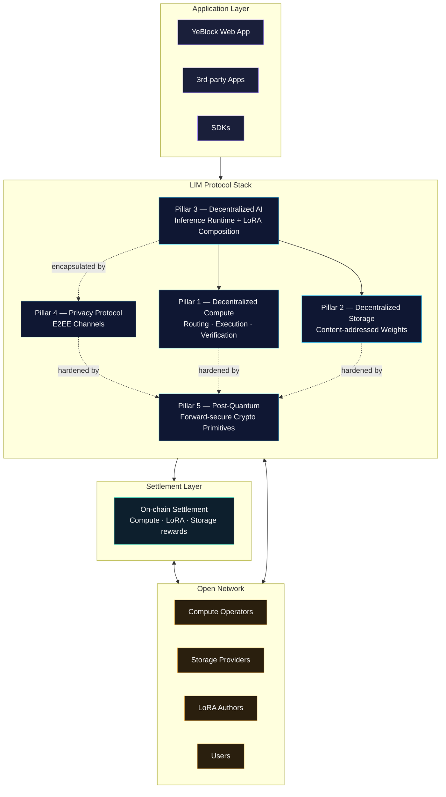

# YeBlock LIM

### A Five-Pillar Decentralized Inference Network

*What DeFi did for money, LIM does for intelligence.*

[Website](https://yeblock.com) · [Architecture](./ARCHITECTURE.md) · [LIM Protocol](./docs/lim-protocol.md) · [Concepts](./docs/concepts.md) · [Discussions](https://github.com/yeblocklim/YeBlock/discussions)

---

> **Status: Pre-Alpha (Q2 2026)**
>
> YeBlock is under active development. The web application is live and accepting waitlist users; the LIM protocol, decentralized inference runtime, settlement contracts, and node client are in design and prototyping. This repository is the public documentation hub. Implementation repositories will be opened progressively as components reach public-test maturity.

---

## Table of Contents

- [Manifesto](#manifesto)
- [The Third Unbundling](#the-third-unbundling)
- [What is LIM?](#what-is-lim)
- [The Five Pillars](#the-five-pillars)
- [Architecture at a Glance](#architecture-at-a-glance)
- [LIM vs The Status Quo](#lim-vs-the-status-quo)
- [Design Targets](#design-targets)
- [What LIM Is Not](#what-lim-is-not)
- [Why "Liquid Intelligence Mesh"](#why-liquid-intelligence-mesh)
- [Repository Map](#repository-map)
- [Status & Milestones](#status--milestones)
- [Documentation](#documentation)
- [Community](#community)
- [License](#license)

---

## Manifesto

Intelligence is the most valuable resource humanity has ever produced.

In the span of three years, we have built machines that compose music, write code, prove theorems, and reason about images at a level indistinguishable from skilled humans. The economic, scientific, and creative implications are larger than any technology shift in living memory.

And we are about to hand the entire thing to four companies.

The hyperscalers — and the closed-weight labs they bankroll — own the GPUs, the model weights, the training data, the inference runtimes, the API surfaces, the safety policies, the pricing power, and the regulatory access. Every prompt you write becomes their training corpus. Every model you fine-tune lives in their tenant. Every business you build sits one terms-of-service revision away from extinction.

This is not a sustainable equilibrium. It is a one-way ratchet toward cognitive feudalism.

LIM is the alternative.

We are building an **open inference protocol** — a substrate where compute is permissionless, model weights are public goods, privacy is cryptographically guaranteed, and economic value flows to the people who actually contribute the hardware, the models, and the LoRA-granular skills that make modern AI work. Not a startup. Not a service. **A protocol** — one that is meant to outlive its founders, its first users, and the cryptographic primitives it ships with.

If you believe inference should be infrastructure, not a product — you are who this is being built for.

> **You are not a consumer. You are a co-builder.**

## The Third Unbundling

The internet has gone through two decisive unbundlings. LIM is the third.

| Wave | What Got Unbundled | The Protocol Layer | The Outcome |
|---|---|---|---|
| **Web 1 → Web 2** | **Content** | HTTP, RSS, Atom, OAuth | Anyone can publish. The gatekeepers of distribution lost their veto. |
| **Web 2 → Web 3** | **Money** | EVM, ERC-20, AMMs, lending protocols | Anyone can issue, swap, lend. The gatekeepers of finance lost their cartel. |
| **Web 3 → Web ∞** | **Intelligence** | **LIM** | Anyone can serve, compose, monetize cognition. The gatekeepers of AI lose their oligopoly. |

Each unbundling produced an explosion of value that the prior gatekeepers said was impossible.

We are at the start of the third one.

## What is LIM?

**LIM (Liquid Intelligence Mesh)** is the protocol stack that powers YeBlock. It is not a product. It is a set of open standards for how inference workloads, model weights, payments, and trust assumptions flow across an open network of independent operators.

A LIM-native inference request:

1. Resolves a model identity (e.g. a base model + a stack of LoRA adapters) against a decentralized weight store.
2. Routes the workload to the lowest-cost qualified compute provider in the global mesh.
3. Streams the response over an encrypted channel that the operator cannot inspect.
4. Settles payment to the compute provider, the LoRA author(s), and the storage providers in a single atomic transaction.

Anyone can be a participant in any role. No registration. No KYC at the protocol layer. No platform veto.

LIM is to AI inference what **HTTP** was to documents and what **the EVM** was to financial primitives — a thin, opinionated, composable layer that everyone agrees to speak so that nobody has to ask permission.

## The Five Pillars

LIM is composed of **five vertically integrated, horizontally composable pillars**. Any application built on LIM inherits all five guarantees by default.

| # | Pillar | What It Does | Why It Matters |
|---|---|---|---|
| 1 | **Decentralized Compute** | Aggregates idle consumer and prosumer GPUs/CPUs into a permissionless inference network with open routing and verifiable execution. | Breaks the hyperscaler oligopoly. Compute is priced by the global market for idle silicon, not by quarterly capacity planning. |
| 2 | **Decentralized Storage** | Content-addressed model and LoRA weight distribution. Weights are persistent public goods, not vendor inventory. | Eliminates "model deprecation as a business strategy." A weight published to LIM remains addressable as long as a single replica exists. |
| 3 | **Decentralized AI** | A composition runtime that resolves base models + LoRA stacks at request time, enabling per-request personalization without retraining. | LoRA-granular composition turns model authorship into a creator economy. Every adapter has an on-chain author. Every inference settles with them. |
| 4 | **Privacy Protocol** | End-to-end encrypted prompt and response channels. Confidential inference where the operator cannot read user data. | Users do not have to choose between "use AI" and "keep my data." The protocol guarantees both. |
| 5 | **Post-Quantum** | Forward-secure cryptographic primitives across the entire stack — transport, storage indexing, settlement, and identity. | The protocol is designed to outlive the cryptographic assumptions it is built on. Settlement records remain verifiable in a post-quantum world. |

> The pillars are not stages. They are layers. A single inference request exercises all five simultaneously.

## Architecture at a Glance

For a deeper architectural breakdown — including request flow, settlement choreography, and security boundaries — see [ARCHITECTURE.md](./ARCHITECTURE.md).

## LIM vs The Status Quo

A side-by-side of the design philosophy. We make these claims about *the protocol* — not about any particular existing implementation. The point is what an open inference protocol *should* be, not where any one vendor falls today.

| Dimension | Centralized AI Cloud | **LIM** |
|---|---|---|
| **Compute supply** | Provisioned by quarterly capex of 4 hyperscalers | Aggregated from a global market for idle silicon |
| **Model weights** | Tenant-locked behind APIs; deprecation by vendor decree | Content-addressed public goods; persistent while a single replica is paid for |
| **LoRA / adapter authorship** | Captured by the platform, royalties opaque or zero | Per-request royalties paid to authors via signed manifests |
| **Privacy** | "Trust us we don't train on your prompts" | E2EE channels + (Phase B) confidential inference. Operators cannot read traffic. |
| **Pricing** | Vendor-set list price | Cleared by the operator market, per request |
| **Censorship surface** | Single ToS revision deplatforms a business | Multiple competing gateways; protocol itself is policy-neutral |
| **Cryptographic posture** | Classical primitives, retroactive vulnerability when quantum arrives | Hybrid post-quantum from day zero |
| **Governance** | Closed product roadmap | Open protocol with public RFC process |
| **Lock-in** | Switching costs by API design | Zero — every artifact is portable by content hash |

This is not a competitive marketing chart. It is a **statement of design priorities**. We chose differently than the closed AI ecosystem chose, and we are explicit about which trade-offs we accepted to do so.

## Design Targets

The numbers below are **engineering targets** for v1.0 mainnet, not current performance. We list them in public to make the design accountable to itself.

| Dimension | Target | Why This Number |
|---|---|---|
| Inference routing latency | **< 250 ms p95** at the protocol layer (excluding model inference itself) | Routing is overhead; it must vanish into the noise of inference latency. |
| Receipt durability | **99.99%** across single-operator failure | Receipts are payment instruments. Losing one is losing money. |
| Operator hardware floor | Any consumer GPU with **≥ 8 GB VRAM** (or equivalent CPU/Apple Silicon class) | The network must absorb gaming GPUs and prosumer Macs, not require A100s. |
| Cost target | **50–90% below hyperscale list pricing** for equivalent latency class | If we cannot beat the hyperscale margin stack, we have not earned our complexity budget. |
| Decentralization floor | **Top-3 operator concentration < 30%** by routed volume in steady state | Anything above is centralization with extra steps. |
| Settlement cadence | **≤ 1 settlement bundle per N seconds**, target N ∈ [10, 60] | Operators should be paid quickly enough that they do not have to trust the network. |
| Cryptographic agility | **Algorithm migration in ≤ 12 months** of standardization | When NIST publishes a new primitive, the protocol must absorb it within a year. |
| Receipt verification | Verifiable in **O(log n)** of bundle size | A user must be able to verify their own inference was paid out, on a phone. |

These targets bind the implementation. If a future implementation cannot hit them, the protocol design — not the targets — will be revisited.

## What LIM Is Not

A protocol's identity is sharpened by what it refuses to be. LIM is **not**:

- **A wrapper around OpenAI.** The protocol does not call third-party APIs and pretend they are decentralized. Every routed inference happens on a network operator running a conformant runtime.
- **A model marketplace.** LIM is a substrate for inference; what models exist on it is decided by authors, not by the protocol.
- **A GPU rental aggregator.** Aggregating idle GPUs is one *consequence* of LIM, not its purpose. Without LoRA composability, royalty settlement, and confidential inference, an aggregator is just a billing front-end.
- **An L1 / L2 / app-chain.** LIM is chain-agnostic at the protocol layer; it requires a settlement chain but does not specify which one.
- **A token-first design.** A network token may exist for staking and settlement. The protocol design does not require the token to have any particular market price; the protocol works with any liquid settlement currency.
- **Politically aligned.** LIM is policy-neutral. Applications enforce the policies their users want; the protocol does not pre-approve a worldview.
- **A research project.** LIM does not invent new cryptographic primitives or training methods. It composes battle-tested standards into a protocol that did not previously exist.

## Why "Liquid Intelligence Mesh"

Three words, deliberately chosen.

- **Liquid** — Capacity, model weights, and economic value flow to where they are most useful, without permission. Idle GPUs become productive inventory; orphaned models become living infrastructure; LoRA authors get paid every time their adapter is composed into an inference. Just as DeFi made money *liquid* across protocols, LIM makes intelligence liquid across operators.
- **Intelligence** — The unit of work is reasoning, not blocks or transactions. LIM is the first protocol where the primary commodity is *cognition*. Bitcoin priced trust. Ethereum priced computation. LIM prices thought.
- **Mesh** — There is no center. Every participant is simultaneously a provider, consumer, and verifier. The network is shaped by who shows up, not by who runs the gateway. A mesh has no single point of failure, no single point of policy, and no single point of capture.

## Repository Map

This repository is the **public documentation hub**. The actual implementation lives in (or will live in) sibling repositories under the [`yeblocklim`](https://github.com/yeblocklim) organization.

| Repository | Status | Description |
|---|---|---|
| [`yeblocklim/YeBlock`](https://github.com/yeblocklim/YeBlock) *(this repo)* | Public | Concept docs, protocol specifications, architecture, governance. |
| `yeblocklim/yeblock-web` | Planned (Q3 2026) | The reference web application — frontend SPA. |
| `yeblocklim/yeblock-contracts` | Planned (post-audit) | Smart contracts for settlement, LoRA royalties, and governance. Will be opened together with first audit. |
| `yeblocklim/yeblock-node` | Planned | Compute operator client (desktop application for contributing GPU/CPU capacity). |
| `yeblocklim/yeblock-sdk` | Planned | Client SDKs for application developers (TypeScript first, then Python and Rust). |

> Implementation repositories will be opened **only when components reach public-test maturity**. Pre-mature open-sourcing of half-built systems is a documented anti-pattern in security-sensitive software; we will not do it.

## Status & Milestones

| Phase | Scope | Status |
|---|---|---|
| **Phase 0 — Concept & Brand** | Whitepaper, brand narrative, public web presence | Complete |
| **Phase 1 — Public Documentation** | This repository, architecture spec, LIM protocol design | In progress |
| **Phase 2 — Reference Application** | Production frontend with account system, AI chat surface, invite mechanics | Live in pre-alpha |
| **Phase 3 — Compute Network Prototype** | Single-region testnet, LoRA composition runtime, off-chain settlement | Design |
| **Phase 4 — Settlement Layer** | Smart contract suite, third-party audit, mainnet deployment | Specification |
| **Phase 5 — Open Network** | Public node onboarding, decentralized governance handover | Planned |

A detailed roadmap with quarterly milestones is published separately and updated each quarter.

## Documentation

| Document | What's Inside |
|---|---|
| [ARCHITECTURE.md](./ARCHITECTURE.md) | Layered system architecture, component responsibilities, request flow, security boundaries, design invariants. |
| [docs/lim-protocol.md](./docs/lim-protocol.md) | LIM protocol design — primitives, composition rules, settlement choreography, threat model, comparison with prior work. |
| [docs/concepts.md](./docs/concepts.md) | The LIM lexicon — every term we coined, defined precisely, in one place. |
| [Discussions](https://github.com/yeblocklim/YeBlock/discussions) | Open Q&A, design debates, governance proposals. |
| [Issues](https://github.com/yeblocklim/YeBlock/issues) | Concrete bug reports, documentation gaps, feature requests. |

## Community

YeBlock is an open project. We welcome contributors at every level — from typo-fixers in the documentation to protocol designers in the discussions.

- **Website** — [yeblock.com](https://yeblock.com)
- **Discussions** — for design conversations and governance proposals.
- **Issues** — for documentation bugs, broken links, and concrete feature requests.
- **Contact** — `ye@yeblock.com` for partnership inquiries, press, and any topic that does not fit the public channels above.
- **Security** — vulnerability reports go to `ye@yeblock.com`. Please follow the disclosure process in [SECURITY.md](./SECURITY.md).

For substantive contributions, read [CONTRIBUTING.md](./CONTRIBUTING.md) first — it explains the workflow, documentation style guide, and review process. All participants are expected to follow our [Code of Conduct](./CODE_OF_CONDUCT.md). If you would like to contribute a substantive change, please open a discussion *before* a pull request — it saves everyone time.

## License

This repository is released under the [MIT License](./LICENSE).

The MIT License applies to all documentation, diagrams, and code samples in this repository. Specific implementation repositories may use different licenses suited to their domain (e.g., smart contracts may use Apache 2.0 or GPL variants, depending on audit and governance considerations).

---

**YeBlock LIM** — Built in public. Designed for permanence.

*"DeFi liberated money. LIM liberates intelligence."*

